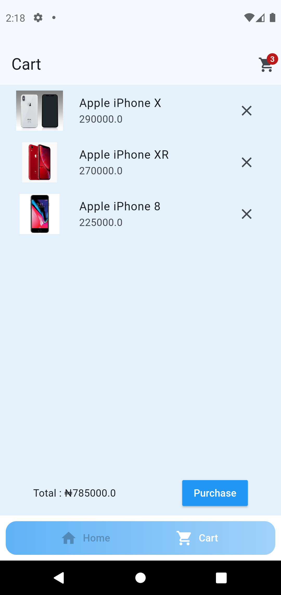

# WShopper
    This is a simple ecommerce application to geared towards the purchase of the Apple IPhone.
## Screenshots
### Home Page

### Checkout Page

# Features
* Ability to add a product and remove to Cart with a double tap
* Ability to display a product in Cart and Home Screen

## Getting Started

### Installation
1. Clone the repository.
   `git clone https://github.com/Ajibola14/WShopper.git`
2. Navigate into the project directory
   `cd wshopper`
3. Install dependencies
   `flutter pub get`
4. Run WShopper
   `flutter run`

### Acknowledgements
   Images sourced from [Unsplash](https://unsplash.com/) and [Google Images](https://google.com)
### API Services
   [Tumbi](https://timbu.cloud/)
### Download
  [Direct Download](https://drive.google.com/file/d/1yJcCeWMtmHvrRxzlJ054BAjtZAx2xe2f/view?usp=drive_link)
  [Appetize](https://appetize.io/apps/android/com.example.wshopper/builds/b_lnrmjchnwfa7bge5bn5w3ejccu)

 